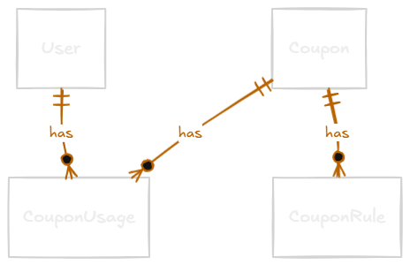

# Coupons System

Sistema de cupons de desconto com regras dinâmicas e extensíveis, desenvolvido como desafio técnico para a Taller.

## Sumário

- [Sobre o projeto](#sobre-o-projeto)
- [Tecnologias](#tecnologias)
- [Decisões arquiteturais](#decisões-arquiteturais)
- [Modelagem de dados](#modelagem-de-dados)
- [Estrutura do projeto](#estrutura-do-projeto)
- [Como rodar](#como-rodar)
- [Endpoints](#endpoints)
- [Testes](#testes)

---

## Sobre o projeto

API REST para gerenciamento de cupons de desconto com suporte a regras de uso dinâmicas. O sistema permite criar cupons com desconto fixo ou percentual, associar múltiplas regras de validação e aplicá-los no checkout com feedback detalhado em caso de falha.

Regras suportadas:

- **Valor mínimo** — exige que o carrinho atinja um valor mínimo
- **Expiração** — invalida o cupom após uma data específica
- **Uso único** — impede que o mesmo usuário utilize o cupom mais de uma vez

---

## Tecnologias

- **NestJS** — framework principal
- **Prisma** + **SQLite** — ORM e banco de dados
- **JWT** — autenticação sem dependência de Passport
- **bcrypt** — hash de senhas
- **Zod** — validação de variáveis de ambiente
- **class-validator** — validação de DTOs nas requisições
- **date-fns** — manipulação de datas
- **Jest** — testes automatizados

---

## Decisões arquiteturais

### Strategy Pattern para regras de cupom

O principal desafio do sistema é ser extensível: adicionar uma nova regra não deve exigir alteração no código existente.

A solução foi o **Strategy Pattern** — cada regra implementa a mesma interface `CouponRule`:

```typescript
interface CouponRule {
  validate(context: ValidationContext): ValidationResult;
}
```

O `CouponValidationService` orquestra as regras sem saber quais são — ele apenas itera e chama `validate()`. Para adicionar uma nova regra, basta criar a classe e registrá-la no `rule-registry.ts`.

### Rule Registry como fonte de verdade

O tipo `RuleType` é derivado automaticamente das chaves do registry:

```typescript
export const ruleRegistry = {
  MINIMUM_VALUE: MinimumValueRule,
  EXPIRATION: ExpirationRule,
  SINGLE_USE: SingleUseRule,
} as const;

export type RuleType = keyof typeof ruleRegistry;
```

Isso mantém o enum do DTO, a validação e a factory sincronizados com uma única fonte de verdade.

### RuleType como string no banco

O tipo da regra é armazenado como `String` no banco, não como enum do Prisma. Enums no banco exigiriam uma migration para cada nova regra, quebrando o princípio de extensibilidade. A validação dos tipos válidos fica na camada de aplicação, no `CouponRuleFactory`.

### Interface TypeScript ao invés de classe abstrata

As regras não compartilham nenhum comportamento comum — cada uma implementa `validate()` do zero. Uma interface expressa exatamente o contrato necessário sem carregar o peso de herança.

### Fail-fast na validação

O `CouponValidationService` para na primeira regra que falha e retorna o motivo específico. Isso evita expor múltiplos erros de uma vez e torna o feedback mais direto ao usuário.

### Índice em CouponUsage.couponId

Como a `SingleUseRule` consulta `previousUsages` filtrados por `couponId` a cada validação, foi adicionado um `@@index([couponId])` explícito para garantir performance nessa query.

### Validade no dia de expiração

O cupom é considerado válido no próprio dia de expiração. A verificação usa `isAfter(currentDate, expDate)`, que retorna `false` quando as datas são iguais — ou seja, um cupom com `expDate: 2026-12-31` ainda é válido durante todo o dia 31/12/2026.

### Parsing de datas sem conversão UTC

O JavaScript interpreta strings ISO `"2026-12-31"` como UTC midnight, o que em fusos negativos como UTC-3 (Brasília) resulta em `30/12/2026 21:00` — um dia a menos. O utilitário `parseLocalDate` resolve isso criando a data no fuso local:

```typescript
export function parseLocalDate(isoDate: string): Date {
  const datePart = isoDate.split('T')[0];
  const [year, month, day] = datePart.split('-').map(Number);
  return new Date(year, month - 1, day);
}
```

Isso também torna a função tolerante a ISO completo (`2026-12-31T00:00:00.000Z`) ou apenas a data (`2026-12-31`).

### Endpoint de criação sem autenticação

O `POST /coupons` não exige autenticação — em produção, esse endpoint seria protegido por um guard de perfil admin. Para este desafio, a simplicidade foi priorizada.

### Validação de ambiente com Zod + EnvService

As variáveis de ambiente são validadas no boot com Zod. O `EnvService` injeta o `ConfigService` do NestJS e expõe um método `get` tipado que retorna tipos inferidos automaticamente:

```typescript
get<T extends keyof Env>(key: T) {
  return this.configService.get(key, { infer: true });
}
```

Isso elimina a necessidade de passar `{ infer: true }` em cada chamada ao longo da aplicação.

---

## Modelagem de dados



## Estrutura do projeto

```
src/
  auth/
    decorators/
    dto/
    interfaces/
    auth.controller.ts
    auth.guard.ts
    auth.module.ts
    auth.service.ts
  env/
    env.ts
    env.service.ts
    env.module.ts
  coupons/
    dto/
    rules/
      coupon-rule.interface.ts
      minimum-value.rule.ts
      expiration.rule.ts
      single-use.rule.ts
      rule-registry.ts
    coupon-rule.factory.ts
    coupon-validation.service.ts
    coupons.service.ts
    coupons.controller.ts
    coupons.module.ts
  prisma/
    prisma.service.ts
    prisma.module.ts
  users/
    users.service.ts
    users.module.ts
  utils/
    parse-local-date.ts
```

---

## Como rodar

**Pré-requisitos:** Node.js 20+

```bash
# Instalar dependências
npm install

# Configurar variáveis de ambiente
cp .env.example .env

# Rodar migrations
npx prisma migrate dev

# Iniciar em desenvolvimento
npm run start:dev
```

A API sobe em `http://localhost:3000` por padrão.

### Variáveis de ambiente

```env
DATABASE_URL="file:./dev.db"
JWT_SECRET="sua_chave_secreta_aqui"
```

---

## Endpoints

### Autenticação

| Método | Rota           | Descrição     | Auth |
| ------ | -------------- | ------------- | ---- |
| POST   | /auth/register | Criar usuário | —    |
| POST   | /auth/login    | Login         | —    |

### Cupons

| Método | Rota           | Descrição     | Auth |
| ------ | -------------- | ------------- | ---- |
| POST   | /coupons       | Criar cupom   | —    |
| GET    | /coupons       | Listar cupons | —    |
| POST   | /coupons/apply | Aplicar cupom | JWT  |

> Cupons criados têm `isActive: true` por padrão. Tentar aplicar um cupom inativo retorna `400 Bad Request`.

### Exemplo — criar cupom

```json
POST /coupons
{
  "code": "DESCONTO20",
  "discountType": "PERCENTAGE",
  "discountValue": 20,
  "rules": [
    { "type": "MINIMUM_VALUE", "config": { "minValue": 100 } },
    { "type": "EXPIRATION", "config": { "expDate": "2026-12-31" } },
    { "type": "SINGLE_USE", "config": {} }
  ]
}
```

### Exemplo — aplicar cupom

```json
POST /coupons/apply
Authorization: Bearer <token>
{
  "code": "DESCONTO20",
  "cartTotal": 200
}
```

```json
// Resposta
{
  "code": "DESCONTO20",
  "discountType": "PERCENTAGE",
  "discountValue": 20,
  "originalTotal": 200,
  "discount": 40,
  "finalTotal": 160
}
```

---

## Testes

```bash
# Rodar testes
npm run test

# Rodar com descrição detalhada
npm run test -- --verbose

# Cobertura
npm run test:cov
```

### Cobertura

| Arquivo                          | O que testa                                      |
| -------------------------------- | ------------------------------------------------ |
| `minimum-value.rule.spec.ts`     | Validação de valor mínimo do carrinho            |
| `expiration.rule.spec.ts`        | Expiração por data, edge case do mesmo dia       |
| `single-use.rule.spec.ts`        | Uso único por usuário, isolamento entre usuários |
| `coupon-rule.factory.spec.ts`    | Instanciação correta, erro em tipo desconhecido  |
| `coupon-validation.service.spec.ts` | Orquestração, fail-fast, múltiplas regras        |
| `coupons.service.spec.ts`        | CRUD, cálculo de desconto, registro de uso       |
